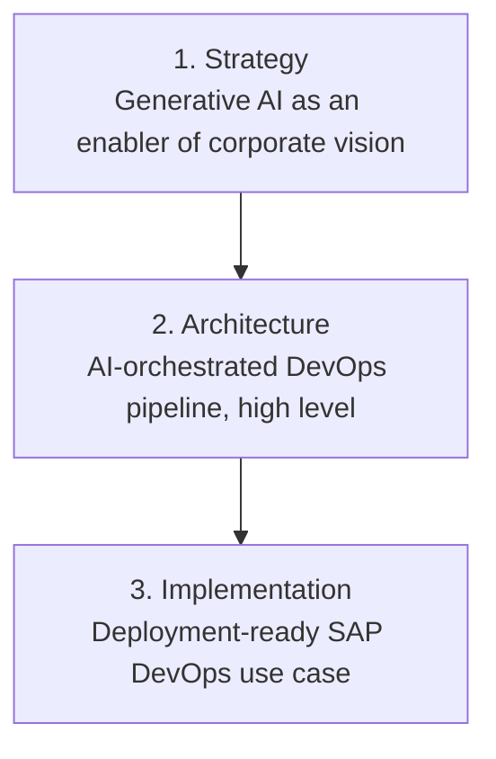

# From AI Strategy to Execution

Three connected pieces of work that trace a single enterprise AI initiative from vision, to architecture, to a deployment-ready implementation. Read top to bottom, they show how a strategic idea becomes a governed, working system.

## How these connect

The strategy sets direction: where AI creates value and where humans stay in control. The architecture turns that direction into a high-level operating model, with autonomous agents handling routine operations behind mandatory human gates. The implementation grounds the architecture in a specific, deployment-ready design for SAP, with a named agent registry, environment tiers, and a phase-by-phase workflow. Each layer justifies the one below it and is justified by the one above it.

## 1. Strategy: Generative AI as an Enabler of Corporate Vision

The top layer. It frames why AI matters to the business and sets the guiding principles: a human-centered digital core, AI applied where it augments human judgment rather than replacing accountability, and investment focused on low-risk, high-value initiatives. It closes with a multi-year adoption view spanning operations, customer applications, business development, and governance.

[Read the strategy (PDF)](1-Generative-AI-Strategy.pdf)

## 2. Architecture: AI-Orchestrated DevOps Pipeline

The middle layer. It starts from a blunt current-state problem: most IT capacity goes to keeping the lights on, patching lags behind the threat curve, and operations are reactive rather than predictive. It then lays out an autonomous DevOps pipeline where an orchestrator coordinates specialized agents across environments, with human approval gates at every boundary and a crawl-walk-run adoption path. Business impact is framed against published industry benchmarks, presented as potential ranges rather than guarantees.

[Read the architecture (PDF)](2-AI-Orchestrated-DevOps-Architecture.pdf)

## 3. Implementation: Deployment-Ready SAP DevOps Use Case

The base layer, where the architecture meets reality. It defines a working registry of twelve specialized agents, each mapped to a real platform and coordinated by a central orchestrator. It specifies network tiers and their autonomy levels, the SAP HANA landscape within each tier, pre-pipeline prerequisites, and a phase-by-phase workflow that runs from sandbox connection and patch validation through development, quality, and production, with human approval gates and full audit logging throughout.

[Read the implementation (PDF)](3-SAP-AI-DevOps-Implementation.pdf)

## About

I am a technology executive working at the intersection of engineering leadership and AI strategy. This body of work reflects how I approach enterprise AI: grounded in business value, governed by human accountability, and detailed enough to actually build. More at [LinkedIn](https://www.linkedin.com/in/ajay-sikha/).
